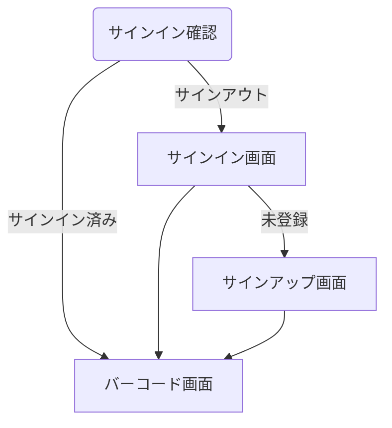

# サインイン画面

## 画面遷移

```mermaid
flowchart
    cond(サインイン確認) -- サインイン済み --> top[バーコード画面];
    cond -- サインアウト --> signin[サインイン画面];
    signin -- 未登録 --> signup[サインアップ画面];
    signin --> top;
    signup --> top;
```

サインイン確認はサインイン画面で行う
